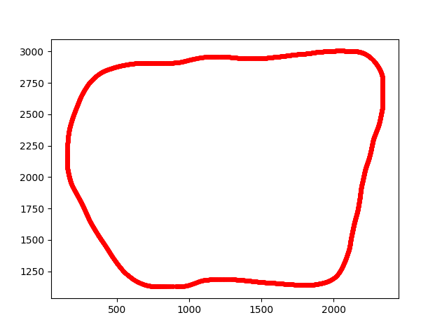
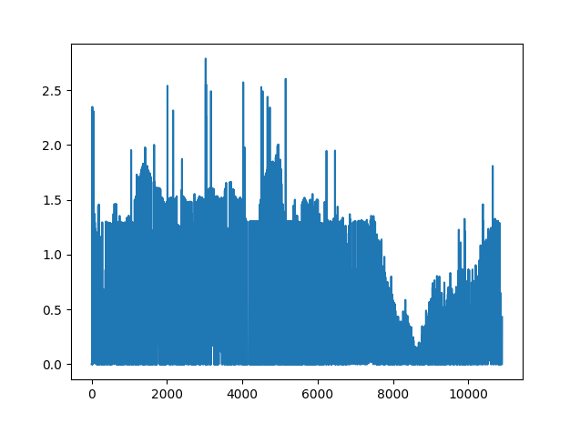

This is the project repo for the final project of the Udacity Self-Driving Car Nanodegree: Programming a Real Self-Driving Car. For more information about the project, see the project introduction [here](https://classroom.udacity.com/nanodegrees/nd013/parts/6047fe34-d93c-4f50-8336-b70ef10cb4b2/modules/e1a23b06-329a-4684-a717-ad476f0d8dff/lessons/462c933d-9f24-42d3-8bdc-a08a5fc866e4/concepts/5ab4b122-83e6-436d-850f-9f4d26627fd9).


Please use **one** of the two installation options, either native **or** docker installation.

## Bottleneck
When I built `waypoint_updateer`, `twist_controller`, `tl_detector`, everything seemed to work well. The car could run a whole lap in the simulator. But when I activated the camera message in the simulator, in order to add traffic light detection, something went wrong.

The car always started to wobble and finally went off the way at a certain area. At first, I thought there could be something special in that area. Therefore I made `waypoint_anaylyzer` and plotted the whole route:



And also the truning angles at each way point



Then I found the car started to wobble around the top right corner of the route, where the turning angles were relatively large. I thought that could be the reason of the problem. Therefore I tried several approaches:

* Instead of giving the closet way point, I gave the way point further away such that the turning angle is not large between successive 3 way points

* Resstrict the throttle when the steering is large

* Change the speed of way point to make it slower

* etc


At some points, the car could go a liitle furthur, although still with much wobbling. But then quickly I encoutered the same problem.

I disabled the camera message again, the car could run properly. I asked a mentor about this problem. He told me that the it should be caused by the bugs in my code. 

One day I accidently changed the publishing rate of way points to 1HZ. The car could go through the top right corner much smoother. But still went off the way after the next traffic light around the middle of the top section of the route. The route there is relatively smooth. This made me realize that something is wrong somewhere in the system: sync between nodes or probably sync between the simulator and the ROS. 

I checked on internet and found that many people had the same problem. And one of them described exact the same problem as mine: the car went off the way at the same area everytime if the camera message was enabled.

I also tried to run the project on another laptop and on the workspace provided by Udacity. Unfortunately none of them worked.

Having been blocked by this problem for several weeks, I just went ahead to work on the remaining part to complete the necessary components. Here I submit this project as it is. Hopefully it can run properly in a proper environment.

## Origial README
### Native Installation

* Be sure that your workstation is running Ubuntu 16.04 Xenial Xerus or Ubuntu 14.04 Trusty Tahir. [Ubuntu downloads can be found here](https://www.ubuntu.com/download/desktop).
* If using a Virtual Machine to install Ubuntu, use the following configuration as minimum:
  * 2 CPU
  * 2 GB system memory
  * 25 GB of free hard drive space

  The Udacity provided virtual machine has ROS and Dataspeed DBW already installed, so you can skip the next two steps if you are using this.

* Follow these instructions to install ROS
  * [ROS Kinetic](http://wiki.ros.org/kinetic/Installation/Ubuntu) if you have Ubuntu 16.04.
  * [ROS Indigo](http://wiki.ros.org/indigo/Installation/Ubuntu) if you have Ubuntu 14.04.
* [Dataspeed DBW](https://bitbucket.org/DataspeedInc/dbw_mkz_ros)
  * Use this option to install the SDK on a workstation that already has ROS installed: [One Line SDK Install (binary)](https://bitbucket.org/DataspeedInc/dbw_mkz_ros/src/81e63fcc335d7b64139d7482017d6a97b405e250/ROS_SETUP.md?fileviewer=file-view-default)
* Download the [Udacity Simulator](https://github.com/udacity/CarND-Capstone/releases).

### Docker Installation
[Install Docker](https://docs.docker.com/engine/installation/)

Build the docker container
```bash
docker build . -t capstone
```

Run the docker file
```bash
docker run -p 4567:4567 -v $PWD:/capstone -v /tmp/log:/root/.ros/ --rm -it capstone
```

### Port Forwarding
To set up port forwarding, please refer to the "uWebSocketIO Starter Guide" found in the classroom (see Extended Kalman Filter Project lesson).

### Usage

1. Clone the project repository
```bash
git clone https://github.com/udacity/CarND-Capstone.git
```

2. Install python dependencies
```bash
cd CarND-Capstone
pip install -r requirements.txt
```
3. Make and run styx
```bash
cd ros
catkin_make
source devel/setup.sh
roslaunch launch/styx.launch
```
4. Run the simulator

### Real world testing
1. Download [training bag](https://s3-us-west-1.amazonaws.com/udacity-selfdrivingcar/traffic_light_bag_file.zip) that was recorded on the Udacity self-driving car.
2. Unzip the file
```bash
unzip traffic_light_bag_file.zip
```
3. Play the bag file
```bash
rosbag play -l traffic_light_bag_file/traffic_light_training.bag
```
4. Launch your project in site mode
```bash
cd CarND-Capstone/ros
roslaunch launch/site.launch
```
5. Confirm that traffic light detection works on real life images

### Other library/driver information
Outside of `requirements.txt`, here is information on other driver/library versions used in the simulator and Carla:

Specific to these libraries, the simulator grader and Carla use the following:

|        | Simulator | Carla  |
| :-----------: |:-------------:| :-----:|
| Nvidia driver | 384.130 | 384.130 |
| CUDA | 8.0.61 | 8.0.61 |
| cuDNN | 6.0.21 | 6.0.21 |
| TensorRT | N/A | N/A |
| OpenCV | 3.2.0-dev | 2.4.8 |
| OpenMP | N/A | N/A |

We are working on a fix to line up the OpenCV versions between the two.
